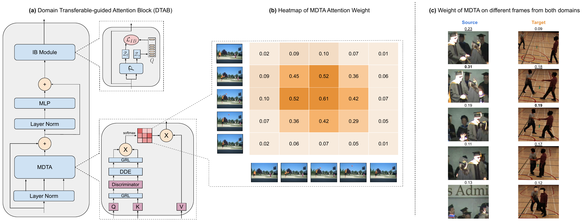

<br />
<p align="center">
  
  <h3 align="center"><strong><br>Transferable-guided Attention Is All You Need for Video Domain Adaptation</strong></h3>

  <p align="center">
      <a href="https://scholar.google.com/citations?user=xBquKMgAAAAJ" target='_blank'>André Sacilotti</a><sup>1</sup>&nbsp;&nbsp;
      <a href="https://scholar.google.com/citations?user=QT362TYAAAAJ" target='_blank'> Samuel Felipe dos Santos</a><sup>2</sup>&nbsp;&nbsp;
      <a href="https://scholar.google.com/citations?user=stFCYOAAAAAJ" target='_blank'>Nicu Sebe</a><sup>3</sup>&nbsp;&nbsp;
      <a href="https://scholar.google.com/citations?user=VSc_vDMAAAAJ" target='_blank'>Jurandy Almeida</a><sup>2</sup>&nbsp;&nbsp;
</p>
    <br>
  <sup>1</sup>University of São Paulo&nbsp;&nbsp;
  <sup>2</sup>Federal University of São Carlos&nbsp;&nbsp;
  <sup>3</sup>University of Trento
  </p>
</p>

<p align="center">
 <a href="https://wacv2025.thecvf.com/" target='_blank'><b>Accepted at WACV 2025</b></a>
</p>

<p align="center">
  <a href="https://arxiv.org/abs/2407.01375" target='_blank'>
    
  </a>
  
  <a href="https://andre-sacilotti.github.io/transferattn-project-page/" target='_blank'>
    
  </a>
  

  <a href="" target='_blank'>
    
  </a>
</p>

</p>

## About

 TransferAttn is a framework for unsupervised domain adaptation (UDA) in videos that leverages Vision Transformers (ViT) by incorporating spatial and temporal transferability into a attention mechanism (DTAB). 

<strong>DTAB Overview</strong> 


## Dataset Preparation

We provide the extracted features used in all experiments. The datasets must be extracted in the folder "{root_path}/dataset"

| Dataset | Google Drive | 
| :-: | :-: |
| UCF101 | [Download I3D](https://drive.google.com/file/d/1GFxToYAoKsiu0_5liPm4xGSOF9C8GnSy) |
| UCF101 | [Download STAM](https://drive.google.com/file/d/1nwTBfX6bUPUGDijWF73AoVboK4jN4Mtf) |
| HMDB51 | [Download I3D](https://drive.google.com/file/d/1Q86XbWTt07SJysR45pcnocVhzJXq7E9j) | 
| HMDB51 | [Download STAM](https://drive.google.com/file/d/1MF1Axu0tV5WXZ9dofmkY57vq0_UfC4ce) | 
| Kinetics and NEC-Drone | [Download STAM*]() |

The Kinetics-Gameplay dataset is a private dataset, so, we cannot share the extracted features. Please refer to [TA3N](https://github.com/cmhungsteve/TA3N) to request access.

*We are having some trouble for uploading the features due to university Google Drive limitations. We aim to make avaible soon, sorry for the inconvinience.

## Getting Started

First, you might need to create the conda environment as following:

```shell
conda env create --file enviroment.yml
```

After that, you can run the experiments:

```shell
bash run.sh
```

The experiments were run on the following GPUS: GTX 1080 Ti, and Titan X. Some variation in performance may occur on different hardwares due to architecture changes.

## TODO List

- [x] Code release.
- [ ] Release download links of extracted features.

## Acknowledgement

We acknowledge the use of the following public resources in the development of this work: [UCF<sub>101</sub>](https://www.crcv.ucf.edu/data/UCF101.php),[HMDB<sub>51</sub>](https://serre-lab.clps.brown.edu/resource/hmdb-a-large-human-motion-database), [MA2LT-D](https://github.com/justchenpp/MA2L-TD), [NEC-Drone](https://github.com/jinwchoi/NEC-Drone-Dataset), [UDAVT](https://github.com/vturrisi/UDAVT) and [TranSVAE](https://github.com/ldkong1205/TranSVAE)


## Citation

If you find TransferAttn useful for your work please consider citing:

```bibtex
@article{sacilotti2024transferattn,
    title={Transferable-guided Attention Is All You Need for Video Domain Adaptationn},
    author={Sacilotti, Andre and dos Santos, Samuel Felipe and Sebe, Nicu and Almeida, Jurandy},
    booktitle={}
    year={2024}
}
```

## License

<a rel="license" href="http://creativecommons.org/licenses/by-nc-sa/4.0/"></a>
<br />
This work is under the <a rel="license" href="http://creativecommons.org/licenses/by-nc-sa/4.0/">Creative Commons Attribution-NonCommercial-ShareAlike 4.0 International License</a>.
